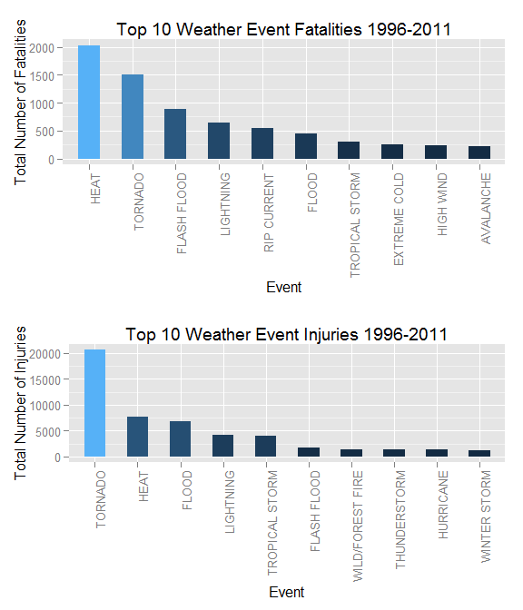
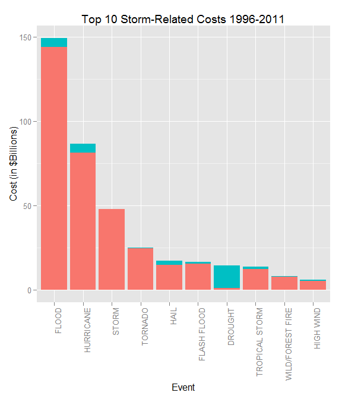

# Impact of Major Storms - Fatalities, Injuries, and Economic
Bill Holst  
January 12, 2016  
##Synopsis of Storm Data Analysis

This analysis examines publicly available storm data, collected by the U.S. National Oceanic and Atmospheric Adminstration (NOAA) in their storm database. This data was collected from 1950 to 2011. 

The database, as described on the NOAA website, has interesting points about the data:

* Only tornado, thunderstorm, wind and hail events were recorded prior to 1996
* From 1996, there were 48 different event types recorded.

These facts point us to the fact that there is some data cleanup needed in the event classification to get meaninful results. Because there is incomplete data prior to 1996, this analysis only covers from 1996 to 2011. 
  
The purpose of this analysis is to reveal the major types of storm events and their impact on both the human population (deaths and injuries), and the economic impact (property and crop damage.)  

The results of the analysis are shown in the Analysis and Results section.

##Data Processing

First, we need to establish our work environment and download the file if we haven't done so already. The downloaded csv file is called 2F2FStormData.csv.bz2.


```r
setwd("~/GitHub/Storm-Data-Analysis")

UrlName = "https://d396qusza40orc.cloudfront.net/repdata%2Fdata%2FStormData.csv.bz2"
csvfile = "2F2FStormData.csv.bz2"

# don't download file if we have already
if (!file.exists(csvfile)) {
    fileUrl = UrlName
    download.file(fileUrl,destfile=csvfile)
    
    dateDownloaded = date()
    dateDownloaded
}
# Read the data and take a look

    StormData = read.csv (csvfile)
    dim(StormData)
```

```
## [1] 902297     37
```

```r
    str(StormData)
```

```
## 'data.frame':	902297 obs. of  37 variables:
##  $ STATE__   : num  1 1 1 1 1 1 1 1 1 1 ...
##  $ BGN_DATE  : Factor w/ 16335 levels "1/1/1966 0:00:00",..: 6523 6523 4242 11116 2224 2224 2260 383 3980 3980 ...
##  $ BGN_TIME  : Factor w/ 3608 levels "00:00:00 AM",..: 272 287 2705 1683 2584 3186 242 1683 3186 3186 ...
##  $ TIME_ZONE : Factor w/ 22 levels "ADT","AKS","AST",..: 7 7 7 7 7 7 7 7 7 7 ...
##  $ COUNTY    : num  97 3 57 89 43 77 9 123 125 57 ...
##  $ COUNTYNAME: Factor w/ 29601 levels "","5NM E OF MACKINAC BRIDGE TO PRESQUE ISLE LT MI",..: 13513 1873 4598 10592 4372 10094 1973 23873 24418 4598 ...
##  $ STATE     : Factor w/ 72 levels "AK","AL","AM",..: 2 2 2 2 2 2 2 2 2 2 ...
##  $ EVTYPE    : Factor w/ 985 levels "   HIGH SURF ADVISORY",..: 834 834 834 834 834 834 834 834 834 834 ...
##  $ BGN_RANGE : num  0 0 0 0 0 0 0 0 0 0 ...
##  $ BGN_AZI   : Factor w/ 35 levels "","  N"," NW",..: 1 1 1 1 1 1 1 1 1 1 ...
##  $ BGN_LOCATI: Factor w/ 54429 levels "","- 1 N Albion",..: 1 1 1 1 1 1 1 1 1 1 ...
##  $ END_DATE  : Factor w/ 6663 levels "","1/1/1993 0:00:00",..: 1 1 1 1 1 1 1 1 1 1 ...
##  $ END_TIME  : Factor w/ 3647 levels ""," 0900CST",..: 1 1 1 1 1 1 1 1 1 1 ...
##  $ COUNTY_END: num  0 0 0 0 0 0 0 0 0 0 ...
##  $ COUNTYENDN: logi  NA NA NA NA NA NA ...
##  $ END_RANGE : num  0 0 0 0 0 0 0 0 0 0 ...
##  $ END_AZI   : Factor w/ 24 levels "","E","ENE","ESE",..: 1 1 1 1 1 1 1 1 1 1 ...
##  $ END_LOCATI: Factor w/ 34506 levels "","- .5 NNW",..: 1 1 1 1 1 1 1 1 1 1 ...
##  $ LENGTH    : num  14 2 0.1 0 0 1.5 1.5 0 3.3 2.3 ...
##  $ WIDTH     : num  100 150 123 100 150 177 33 33 100 100 ...
##  $ F         : int  3 2 2 2 2 2 2 1 3 3 ...
##  $ MAG       : num  0 0 0 0 0 0 0 0 0 0 ...
##  $ FATALITIES: num  0 0 0 0 0 0 0 0 1 0 ...
##  $ INJURIES  : num  15 0 2 2 2 6 1 0 14 0 ...
##  $ PROPDMG   : num  25 2.5 25 2.5 2.5 2.5 2.5 2.5 25 25 ...
##  $ PROPDMGEXP: Factor w/ 19 levels "","-","?","+",..: 17 17 17 17 17 17 17 17 17 17 ...
##  $ CROPDMG   : num  0 0 0 0 0 0 0 0 0 0 ...
##  $ CROPDMGEXP: Factor w/ 9 levels "","?","0","2",..: 1 1 1 1 1 1 1 1 1 1 ...
##  $ WFO       : Factor w/ 542 levels ""," CI","$AC",..: 1 1 1 1 1 1 1 1 1 1 ...
##  $ STATEOFFIC: Factor w/ 250 levels "","ALABAMA, Central",..: 1 1 1 1 1 1 1 1 1 1 ...
##  $ ZONENAMES : Factor w/ 25112 levels "","                                                                                                                               "| __truncated__,..: 1 1 1 1 1 1 1 1 1 1 ...
##  $ LATITUDE  : num  3040 3042 3340 3458 3412 ...
##  $ LONGITUDE : num  8812 8755 8742 8626 8642 ...
##  $ LATITUDE_E: num  3051 0 0 0 0 ...
##  $ LONGITUDE_: num  8806 0 0 0 0 ...
##  $ REMARKS   : Factor w/ 436781 levels "","-2 at Deer Park\n",..: 1 1 1 1 1 1 1 1 1 1 ...
##  $ REFNUM    : num  1 2 3 4 5 6 7 8 9 10 ...
```

We only need a summary of this data, so we eliminate all but the 9 fields of interest for the analysis. These are the fields related to injuries, fatalities, and economic impact.

The NOA website at http://www.ncdc.noaa.gov/stormevents/details.jsp?type=eventtype informs us that prior to 1996, they only recorded tornado, thunderstorm, wind and hail events. To ensure consistent detail, we will use a subset of the data which includes only events from 1996 through 2011.


```r
StormData <- StormData[, c("BGN_DATE", "EVTYPE", "FATALITIES","INJURIES",                           "PROPDMG","PROPDMGEXP","CROPDMG","CROPDMGEXP")]
dim(StormData)
```

```
## [1] 902297      8
```

```r
summary(StormData$EVTYPE)
```

```
##                     HAIL                TSTM WIND        THUNDERSTORM WIND 
##                   288661                   219940                    82563 
##                  TORNADO              FLASH FLOOD                    FLOOD 
##                    60652                    54277                    25326 
##       THUNDERSTORM WINDS                HIGH WIND                LIGHTNING 
##                    20843                    20212                    15754 
##               HEAVY SNOW               HEAVY RAIN             WINTER STORM 
##                    15708                    11723                    11433 
##           WINTER WEATHER             FUNNEL CLOUD         MARINE TSTM WIND 
##                     7026                     6839                     6175 
## MARINE THUNDERSTORM WIND               WATERSPOUT              STRONG WIND 
##                     5812                     3796                     3566 
##     URBAN/SML STREAM FLD                 WILDFIRE                 BLIZZARD 
##                     3392                     2761                     2719 
##                  DROUGHT                ICE STORM           EXCESSIVE HEAT 
##                     2488                     2006                     1678 
##               HIGH WINDS         WILD/FOREST FIRE             FROST/FREEZE 
##                     1533                     1457                     1342 
##                DENSE FOG       WINTER WEATHER/MIX           TSTM WIND/HAIL 
##                     1293                     1104                     1028 
##  EXTREME COLD/WIND CHILL                     HEAT                HIGH SURF 
##                     1002                      767                      725 
##           TROPICAL STORM           FLASH FLOODING             EXTREME COLD 
##                      690                      682                      655 
##            COASTAL FLOOD         LAKE-EFFECT SNOW        FLOOD/FLASH FLOOD 
##                      650                      636                      624 
##                LANDSLIDE                     SNOW          COLD/WIND CHILL 
##                      600                      587                      539 
##                      FOG              RIP CURRENT              MARINE HAIL 
##                      538                      470                      442 
##               DUST STORM                AVALANCHE                     WIND 
##                      427                      386                      340 
##             RIP CURRENTS              STORM SURGE            FREEZING RAIN 
##                      304                      261                      250 
##              URBAN FLOOD     HEAVY SURF/HIGH SURF        EXTREME WINDCHILL 
##                      249                      228                      204 
##             STRONG WINDS           DRY MICROBURST    ASTRONOMICAL LOW TIDE 
##                      196                      186                      174 
##                HURRICANE              RIVER FLOOD               LIGHT SNOW 
##                      174                      173                      154 
##         STORM SURGE/TIDE            RECORD WARMTH         COASTAL FLOODING 
##                      148                      146                      143 
##               DUST DEVIL         MARINE HIGH WIND        UNSEASONABLY WARM 
##                      141                      135                      126 
##                 FLOODING   ASTRONOMICAL HIGH TIDE        MODERATE SNOWFALL 
##                      120                      103                      101 
##           URBAN FLOODING               WINTRY MIX        HURRICANE/TYPHOON 
##                       98                       90                       88 
##            FUNNEL CLOUDS               HEAVY SURF              RECORD HEAT 
##                       87                       84                       81 
##                   FREEZE                HEAT WAVE                     COLD 
##                       74                       74                       72 
##              RECORD COLD                      ICE  THUNDERSTORM WINDS HAIL 
##                       64                       61                       61 
##      TROPICAL DEPRESSION                    SLEET         UNSEASONABLY DRY 
##                       60                       59                       56 
##                    FROST              GUSTY WINDS      THUNDERSTORM WINDSS 
##                       53                       53                       51 
##       MARINE STRONG WIND                    OTHER               SMALL HAIL 
##                       48                       48                       47 
##                   FUNNEL             FREEZING FOG             THUNDERSTORM 
##                       46                       45                       45 
##       Temperature record          TSTM WIND (G45)         Coastal Flooding 
##                       43                       39                       38 
##              WATERSPOUTS    MONTHLY PRECIPITATION                    WINDS 
##                       37                       36                       36 
##                  (Other) 
##                     2940
```

```r
UniqueEvents = unique(StormData$EVTYPE)
noEvents = length(UniqueEvents)
```

There are 985 distinct values for event type. This list must be consolidated into fewer groups.


```r
# select only the fatalities and injuries
StormSubset = StormData[StormData$FATALITIES>0 | 
    StormData$INJURIES > 0 | StormData$PROPDMG > 0 |
    StormData$CROPDMG > 0, ]
StormSubset$Dt = as.POSIXlt(StormSubset$BGN_DATE,format="%m/%d/%Y %H:%M:%S")
# select the data since 1996
Since1996=StormSubset[format(StormSubset$Dt,"%Y") >= "1996",]
```

Apply a little cleanup to the EVTYPE field.


```r
trim <- function (x) gsub("^\\s+|\\s+$", "", x)
Since1996$EVTYPE = trim(Since1996$EVTYPE)
# convert all to upper
Since1996$EVTYPE = toupper(Since1996$EVTYPE)
```
From the above summary, the event type field is what we need to break the storm data into meaninful groups. However, the data is very dirty, e.g. TSTM WIND is most likely the same as THUNDERSTORM WIND. As a matter of fact, there are  There are 985 unique values - we should try to analyze around 8 to 10 major storm groupings, consolidating some of the obvious duplicates. 

Fortunately, a researcher, Coursea colleague, and R blogger named Mauricio Linhares has developed a substitiution table to eliminate the various misspellings and duplicate entries in the EVNTYPE field. His information about the process is at http://rpubs.com/jlutzwpi/56060. In the spirit of reproducible research, we choose to use his well-crafted substitution table to consolidate our events into a very workable number. 

The translation file that normalizes the event data is called replacements.csv, which we merge with the event data.


```r
url2 = 
    "https://raw.githubusercontent.com/mauricio/reproductible-research-assignment-2/master/replacements.csv"
if (!file.exists("replacements.csv")) {
    download.file (url2,"replacements.csv")
}
repl = read.csv("replacements.csv",stringsAsFactors = FALSE)
names(repl) = c("x","EVTYPE","Event")

# Merge these over the EVTYPE field  

Since1996Merged = merge(Since1996,repl,by="EVTYPE")
names(Since1996Merged) =  c(names(Since1996Merged[1:10]),"Event")
dim(Since1996Merged)
```

```
## [1] 201318     11
```

```r
# group the data by total fatalities and injuries

FatalandInjuries =aggregate(
    x=Since1996Merged[,c("FATALITIES","INJURIES")],
    by=list(Since1996Merged$Event),FUN="sum")

# create the ordered fatality and injury data

SortedFatal=
    FatalandInjuries [order(-FatalandInjuries$FATALITIES),][1:10,]
SortedInjuries = 
    FatalandInjuries [order(-FatalandInjuries$INJURIES),][1:10,]
```
We also need to compute the cost of the events. First, some data cleanup must occur. The in both cases, dollar cost is codified by fields that indicate the magnitude of the cost: K-1000, M-millions and B-billions. A little math then calculates the cost of each.


```r
Since1996Merged$PropFactor = 1
Since1996Merged$PropFactor [Since1996Merged$PROPDMGEXP=="K"] = 1000
Since1996Merged$PropFactor [Since1996Merged$PROPDMGEXP=="M"] = 1000000
Since1996Merged$PropFactor [Since1996Merged$PROPDMGEXP=="B"] = 1000000000
Since1996Merged$CropFactor = 1
Since1996Merged$CropFactor [Since1996Merged$CROPDMGEXP=="K"] = 1000
Since1996Merged$CropFactor [Since1996Merged$CROPDMGEXP=="M"] = 1000000
Since1996Merged$CropFactor [Since1996Merged$CROPDMGEXP=="B"] = 1000000000
Since1996Merged$PropertyExpense = Since1996Merged$PROPDMG * Since1996Merged$PropFactor
Since1996Merged$CropExpense = Since1996Merged$CROPDMG * Since1996Merged$CropFactor
Since1996Merged$TotalExpense = 
    Since1996Merged$PropertyExpense + Since1996Merged$CropExpense

EventCosts = aggregate(
    x=Since1996Merged[
        ,c("PropertyExpense","CropExpense","TotalExpense")],
         by=list(Since1996Merged$Event),FUN="sum")

# pick the top 10 most expensive event catagories

SortedEventCosts=EventCosts[order(-EventCosts$TotalExpense),][1:10,]
```
## Results

The top 10 worst weather events from 1996 to 2011 are shown below, both in terms of fatalities and injuries:


```r
library(ggplot2)
library(gridExtra)

p1 = ggplot(data=SortedFatal,
        aes(x=reorder(Group.1, -FATALITIES),
        y=FATALITIES,fill=FATALITIES)) +  
        geom_bar(stat="identity", width = 0.5) +
        xlab("Event") +
        ylab("Total Number of Fatalities") +
        theme(legend.position="none",
        axis.text.x = element_text(angle = 90, hjust = 1)) +
        ggtitle("Top 10 Weather Event Fatalities 1996-2011")
        
p2 = ggplot(data=SortedInjuries, height = 5,
        aes(x=reorder(Group.1, -INJURIES),
        y=INJURIES,fill=INJURIES)) +  
        geom_bar(stat="identity", width = 0.5) +
        xlab("Event") +
        ylab("Total Number of Injuries") +
        theme(legend.position="none",
        axis.text.x = element_text(angle = 90, hjust = 1)) +
        ggtitle("Top 10 Weather Event Injuries 1996-2011") 

grid.arrange( p1, p2, nrow=2)
```

 

Now, we need to analyze the cost of the major events. First, we look at the sorted expenses.


```r
SortedEventCosts
```

```
##              Group.1 PropertyExpense CropExpense TotalExpense
## 31             FLOOD    144003143200  4983266500 148986409700
## 53         HURRICANE     81118659010  5349282800  86467941810
## 86             STORM     47834724000      855000  47835579000
## 90           TORNADO     24616945710   283425010  24900370720
## 41              HAIL     14595213420  2496822450  17092035870
## 30       FLASH FLOOD     15222268910  1334901700  16557170610
## 20           DROUGHT      1046101000 13367566000  14413667000
## 92    TROPICAL STORM     12173376990  1296322600  13469699590
## 102 WILD/FOREST FIRE      7760449500   402255130   8162704630
## 52         HIGH WIND      5248378360   633561300   5881939660
```
The costs in this analysis have not been normalized for inflation. That is beyond the scope of the exercise. 

In general, the property damage exceeds crop damage by considerable amount. We show both in a stacked bar chart. The following figure shows total storm-related expense by most expensive event:


```r
library (reshape2)
SortedEventCosts=EventCosts[order(-EventCosts$TotalExpense),][1:10,]
Melted=melt(SortedEventCosts, id.var="Group.1")
Melted = Melted[Melted$variable != "TotalExpense",]
names(Melted) = c("Event","Type","Expense")
ggplot(Melted,aes(x=reorder(Event,-Expense),
    y=Expense/1000000000,fill=Type)) +
    geom_bar(stat="identity") +
    ylab("Cost (in $Billions)") +
    xlab("Event") +
    theme (legend.position="none",
    axis.text.x = element_text(angle = 90, hjust = 1)) +
    ggtitle("Top 10 Storm-Related Costs 1996-2011") 
```

 

### Summary and Conclusions

Reviewing the graphs, we find that tornados play a major factor in terms of injuries and death, ranking first in injuries and second in deaths. Heat-related situations result in the most deaths, and rank second in injuries. Overall cost of events find that floods are the largest contributor to economic cost of storm-related events. Both floods and flash floods are among the top six events.  Drought is the only event that contributes primarily to crop damage. 

One point of interest is the relationship between hurricanes and floods. Hurricane Katrina was the most expensive natural disaster in U.S. history, with costs exceeding $126 billion, with at least half of the cost the related flooding following the levy breaks 
(see http://useconomy.about.com/od/grossdomesticproduct/f/katrina_damage.htm.)  It is not clear from this analysis whether those costs are included only in the hurricane event or split over the flood events too.

An interesting follow up to this analysis would be to find out how hurricane and flood events were reported, to see if hurricanes might be a root cause of flood reporting.

## References

NOAA Website - http://www.ncdc.noaa.gov/stormevents/details.jsp?type=eventtype

Event Cross Reference - http://rpubs.com/jlutzwpi/56060

Data Location - "https://d396qusza40orc.cloudfront.net/repdata%2Fdata%2FStormData.csv.bz2"

Coursera Project Information - https://www.coursera.org/learn/reproducible-research/peer/OMZ37/course-project-2

Katrina Costs: http://useconomy.about.com/od/grossdomesticproduct/f/katrina_damage.htm
